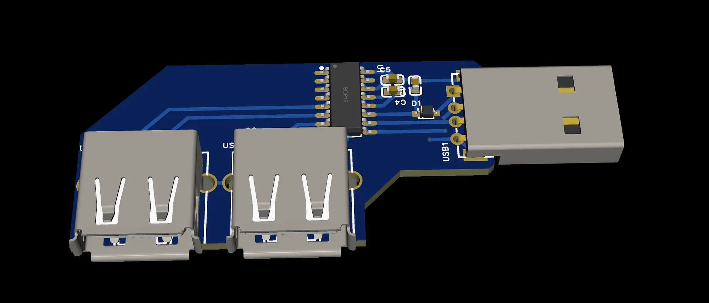
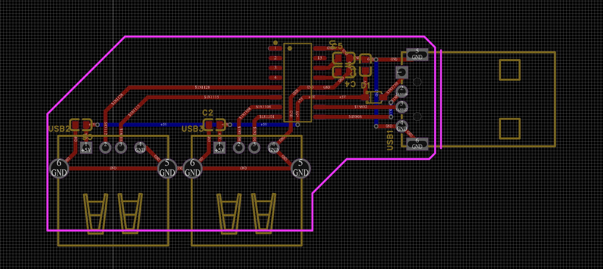
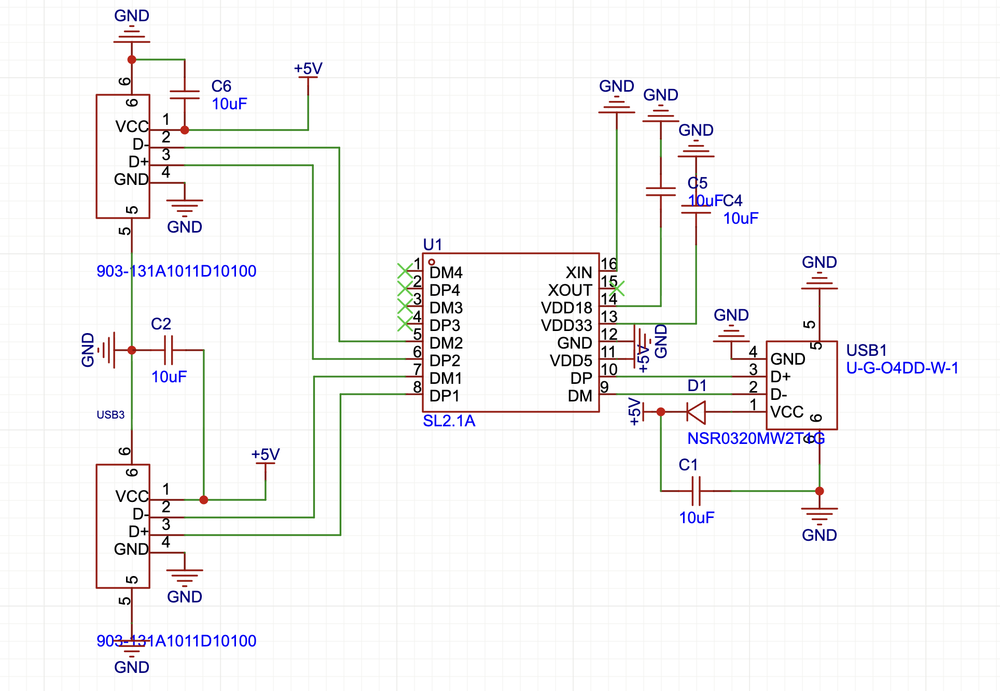
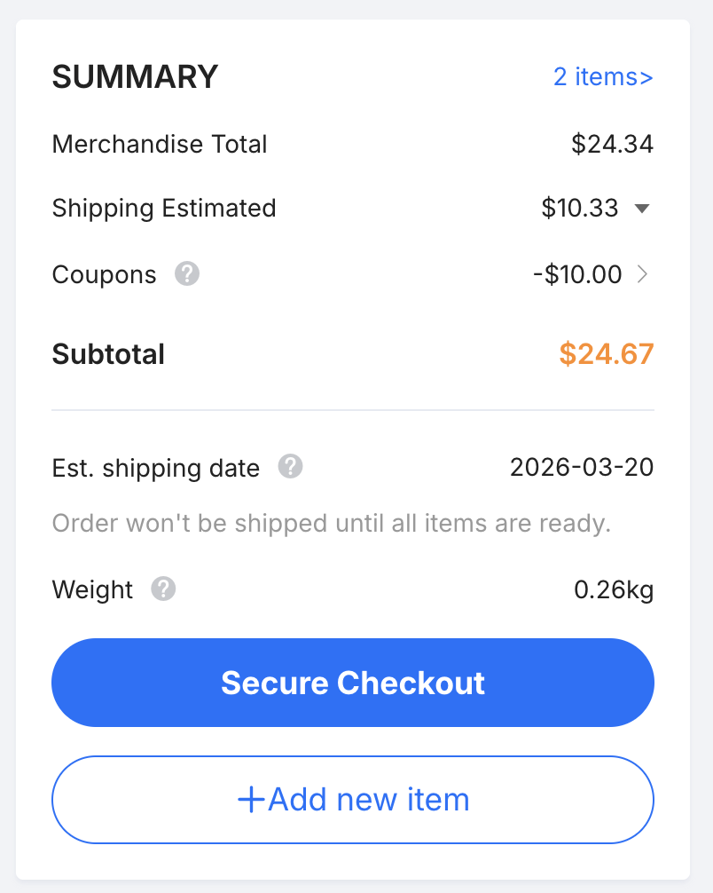

# USB Hub

### What is this? 
A USB Hub I built which is my first hardware project in my life, and I followed this guide - https://jams.hackclub.com/batch/usb-hub

### How to use this?
It has one male port which goes into your laptop and two female ports so that you can get 2 ports even with only 1 port in your laptop.

### Why this?
I only did software till now, and I wanted to get my hands dirty on something new. So I followed the guide and it was really fun learning all the new things.

# BOM

| No. | Quantity | Comment            | Designator     | Footprint                        | Value | Manufacturer Part  | Manufacturer        | Supplier Part | Supplier |
|-----|----------|--------------------|----------------|----------------------------------|-------|--------------------|---------------------|---------------|----------|
| 1   | 5        | 10uF               | C1,C2,C4,C5,C6 | C0603                            | 10uF  | CL10A106KP8NNNC    | SAMSUNG(三星)       | C19702        | LCSC     |
| 2   | 1        | NSR0320MW2T1G      | D1             | SOD-323_L1.8-W1.3-LS2.5-RD       |       | NSR0320MW2T1G      | onsemi(安森美)      | C48192        | LCSC     |
| 3   | 1        | SL2.1A             | U1             | SOP-16_L10.0-W3.9-P1.27-LS6.0-BL |       | SL2.1A             | CoreChips(和芯润德) | C192893       | LCSC     |
| 4   | 1        | U-G-O4DD-W-1       | USB1           | USB-A-TH_U-G-04WD-W-01           |       | U-G-O4DD-W-1       | 韩国韩荣            | C98125        | LCSC     |
| 5   | 2        | 903-131A1011D10100 | USB2,USB3      | USB-A-TH_C46407                  |       | 903-131A1011D10100 | 精拓金              | C46407        | LCSC     |

# Cost
Everything is included in the PCBA.
Final Cost - ~$24.67

